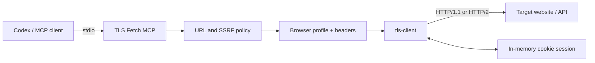

<div align="center">

# TLS Fetch MCP

**Browser-like HTTP requests for AI coding agents — implemented as a secure, local MCP server in Go.**

[](https://github.com/JakobAIOdev/tls-fetch-mcp/actions/workflows/ci.yml)
[](https://go.dev/)
[](https://modelcontextprotocol.io/)
[](LICENSE)

[Features](#features) · [Quick start](#quick-start) · [Codex setup](#use-with-codex) · [Tool reference](#tool-reference) · [Security](#security-model)

</div>

TLS Fetch MCP gives Codex and other MCP clients a controlled HTTP client with
browser-like TLS fingerprints. It is designed for web development, API
inspection, debugging, and authorized scraping where a regular Go
`net/http.Client` does not accurately resemble a modern browser.

It uses [`bogdanfinn/tls-client`](https://github.com/bogdanfinn/tls-client) for
TLS and HTTP fingerprinting and the official
[`modelcontextprotocol/go-sdk`](https://github.com/modelcontextprotocol/go-sdk)
for MCP.

## Features

- **Browser TLS fingerprints** — Chrome, Firefox, Safari, Brave, Opera, mobile
  applications, and every profile exposed by the installed `tls-client`
  version.
- **Complete HTTP requests** — GET, HEAD, POST, PUT, PATCH, DELETE, and OPTIONS
  with custom headers, bodies, redirect behavior, and timeouts.
- **Accurate header behavior** — sensible browser headers, matching user-agent
  versions, and optional explicit header ordering.
- **Cookie sessions** — preserve cookies across multi-step request flows with a
  caller-chosen `session_id`, then explicitly clear the session.
- **Proxy support** — optional HTTP, HTTPS, SOCKS5, and SOCKS5H proxies.
- **Structured responses** — status, final URL, headers, content type, body,
  timing, truncation state, selected profile, and session metadata.
- **Binary-safe output** — non-UTF-8 response bodies are returned as Base64.
- **Resource controls** — server-side timeout, response-size, session-count,
  and redirect limits.
- **Secure by default** — private networks, loopback, link-local ranges,
  multicast, unspecified addresses, and caller-supplied proxies are blocked
  unless the operator explicitly enables them.
- **DNS-rebinding protection** — addresses are checked before the request and
  again immediately before the network connection.
- **Single local binary** — no browser, Node.js runtime, or background daemon
  required.

## How it works



The MCP client starts the server as a local `stdio` process. Every requested
URL passes through the host allowlist and IP policy. The server then builds a
fingerprinted client, performs the request, limits the response, and returns a
typed MCP result.

## Quick start

### Requirements

- Go 1.24.1 or newer
- An MCP client with local `stdio` server support

### Build from source

```bash
git clone https://github.com/JakobAIOdev/tls-fetch-mcp.git
cd tls-fetch-mcp
make build
```

The binary is written to `bin/tls-fetch-mcp`.

You can also run it directly:

```bash
go run ./cmd/tls-fetch-mcp
```

Check a built binary:

```bash
./bin/tls-fetch-mcp --version
```

Once the repository is published, installation with Go is also supported:

```bash
go install github.com/JakobAIOdev/tls-fetch-mcp/cmd/tls-fetch-mcp@latest
```

## Use with Codex

Codex can load an MCP server globally from `~/.codex/config.toml` or only for a
trusted repository from `<project>/.codex/config.toml`.

### Project-scoped configuration

Create `.codex/config.toml` in the project where Codex should use the server:

```toml
[mcp_servers.tls_fetch]
command = "/absolute/path/to/tls-fetch-mcp"
enabled = true
required = true
enabled_tools = ["tls_fetch", "tls_profiles", "tls_session_clear"]
startup_timeout_sec = 10
tool_timeout_sec = 120
default_tools_approval_mode = "prompt"

[mcp_servers.tls_fetch.tools.tls_profiles]
approval_mode = "auto"
```

For local development targets such as `localhost:3000`, add:

```toml
[mcp_servers.tls_fetch.env]
MCP_TLS_FETCH_ALLOW_PRIVATE = "true"
```

Restart Codex or open a new task after changing the configuration. Use `/mcp`
to verify that `tls_fetch`, `tls_profiles`, and `tls_session_clear` are
available.

### Global CLI configuration

```bash
codex mcp add tls-fetch \
  -- /absolute/path/to/tls-fetch-mcp
```

To permit local development targets globally:

```bash
codex mcp add tls-fetch \
  --env MCP_TLS_FETCH_ALLOW_PRIVATE=true \
  -- /absolute/path/to/tls-fetch-mcp
```

Verify the configuration:

```bash
codex mcp list
```

## Tool reference

### `tls_fetch`

Sends one fingerprinted HTTP request.

| Input | Type | Default | Description |
| --- | --- | --- | --- |
| `url` | string | required | Absolute HTTP or HTTPS URL |
| `method` | string | `GET` | GET, HEAD, POST, PUT, PATCH, DELETE, or OPTIONS |
| `headers` | object | browser defaults | Request header name-value pairs |
| `header_order` | string[] | browser-like order | Explicit lower-case header order |
| `body` | string | empty | Raw request body |
| `profile` | string | `chrome_146` | TLS profile returned by `tls_profiles` |
| `follow_redirects` | boolean | `true` | Follow up to ten policy-checked redirects |
| `timeout_seconds` | integer | `30` | Whole-request timeout, capped by server configuration |
| `max_response_bytes` | integer | `524288` | Per-request response limit, capped by server configuration |
| `proxy_url` | string | empty | Optional proxy; requires operator opt-in |
| `session_id` | string | empty | Optional cookie-session identifier |

Example prompt:

```text
Use tls_fetch with the chrome_146 profile to GET
https://example.com. Return the status, final URL, content type,
and the HTML title.
```

Example POST:

```text
Use tls_fetch to POST {"query":"mcp"} to https://example.com/api/search.
Set Content-Type to application/json and use the firefox_148 profile.
```

### `tls_profiles`

Returns the default profile and every fingerprint supported by the pinned
`tls-client` version. Profile availability follows the dependency version
rather than a hardcoded MCP schema enum.

### `tls_session_clear`

Deletes one in-memory cookie session.

Cookie-session workflow:

```text
1. Fetch the login page with session_id "example-login".
2. Submit the form with the same session_id.
3. Fetch the authenticated page with the same session_id.
4. Clear "example-login" with tls_session_clear.
```

Session IDs may contain letters, digits, dots, underscores, and hyphens and
must not exceed 128 characters.

## Configuration

All server-level behavior is configured through environment variables. Tool
callers may choose stricter request limits but cannot exceed these values.

| Variable | Default | Description |
| --- | ---: | --- |
| `MCP_TLS_FETCH_ALLOW_PRIVATE` | `false` | Allow private, loopback, and link-local targets |
| `MCP_TLS_FETCH_ALLOW_PROXY` | `false` | Allow callers to provide `proxy_url` |
| `MCP_TLS_FETCH_ALLOWED_HOSTS` | empty | Comma-separated host allowlist; supports `*.example.com` |
| `MCP_TLS_FETCH_MAX_RESPONSE_BYTES` | `524288` | Maximum returned response body size |
| `MCP_TLS_FETCH_DEFAULT_TIMEOUT_SECONDS` | `30` | Default whole-request timeout |
| `MCP_TLS_FETCH_MAX_TIMEOUT_SECONDS` | `120` | Maximum caller-selectable timeout |
| `MCP_TLS_FETCH_MAX_SESSIONS` | `64` | Maximum in-memory cookie sessions |

Example: restrict the server to one domain and increase the response limit to
2 MiB:

```bash
MCP_TLS_FETCH_ALLOWED_HOSTS='example.com,*.example.com' \
MCP_TLS_FETCH_MAX_RESPONSE_BYTES=2097152 \
./bin/tls-fetch-mcp
```

## Security model

The server treats every tool argument as untrusted.

- Only absolute `http` and `https` target URLs are accepted.
- URL-embedded credentials are rejected; authentication belongs in headers.
- Hop-by-hop and transport-managed request headers cannot be overridden.
- Host allowlists are checked before DNS resolution.
- Every resolved IP address must pass the network policy.
- Direct connections resolve and validate the address again at dial time.
- Redirect destinations pass through the same URL and IP policy.
- Unspecified and multicast destinations remain blocked even when private
  targets are enabled.
- Proxy use requires explicit operator opt-in.
- Responses and session counts are bounded.

When a proxy is enabled, the proxy performs the final target connection and may
resolve DNS differently from the MCP host. Only configure proxies you trust.

For the complete threat model and reporting process, see
[`SECURITY.md`](SECURITY.md).

## Important limitations

- TLS fingerprinting is not full browser automation. This server does not run
  JavaScript, render a DOM, solve CAPTCHAs, or reproduce browser behavior.
- HTTP/3 is intentionally disabled so the direct connection can always pass
  through the dial-time SSRF policy. HTTP/1.1 and HTTP/2 fingerprinting remain
  active.
- Cookie sessions live only in memory and disappear when the server exits.
- A successful request does not grant permission to scrape a service or bypass
  its access controls.

For JavaScript-heavy flows, pair this server with a browser automation MCP
instead of trying to turn HTTP requests into a browser.

## Development

Common commands:

```bash
make format
make test
make vet
make build
make check
```

Run the optional live TLS integration test:

```bash
TLS_FETCH_INTEGRATION_URL=https://example.com make test-integration
```

Project layout:

```text
cmd/tls-fetch-mcp/   MCP server entry point and tool registration
internal/fetch/      Fetch engine, URL policy, configuration, and tests
.github/             CI, dependency updates, and contribution templates
```

Pull requests run formatting checks, tests, `go vet`, and a clean build on
Linux, macOS, and Windows. Tags matching `v*` create cross-platform release
archives and SHA-256 checksums.

## Roadmap

- Optional persistent encrypted cookie stores
- Request/response observability without leaking secrets
- Configurable profile aliases and default profiles
- Optional extraction helpers for HTML and JSON
- HTTP/3 support with equivalent connection-policy enforcement

Contributions and focused feature proposals are welcome. Read
[`CONTRIBUTING.md`](CONTRIBUTING.md) before opening a pull request.

## Responsible use

Only access systems you are authorized to test or automate. Respect applicable
laws, terms of service, robots directives, privacy requirements, and rate
limits. Do not use this project to evade access controls or cause harm.

## License

Released under the [MIT License](LICENSE).
